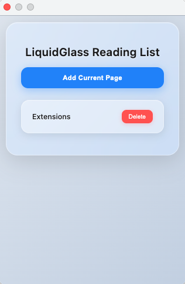

# Liquid Glass Reading List

A beautiful browser extension with a glassmorphism UI for managing your reading list.



## Features

- ✨ Modern glassmorphism (liquid glass) design
- 📚 Add current web pages to your reading list
- 🗑️ Delete items with one click
- 🔄 Syncs across devices (using Chrome sync storage)
- 🚫 Prevents duplicate entries
- 📱 Responsive and clean interface

## Installation

### For Chrome/Edge:

1. Open Chrome and navigate to `chrome://extensions/`
2. Enable **Developer mode** (toggle in top right)
3. Click **Load unpacked**
4. Select the `reading-list-extension` folder
5. The extension icon should appear in your toolbar!

### For Firefox:

1. Navigate to `about:debugging#/runtime/this-firefox`
2. Click **Load Temporary Add-on**
3. Select any file from the `reading-list-extension` folder
4. Note: For Firefox, you may need to adjust the manifest slightly

## Usage

1. Click the extension icon in your browser toolbar
2. Click **Add Current Page** to save the current webpage
3. View your saved pages in the popup list
4. Click any link to open it in a new tab
5. Click **Delete** to remove items from your list

## Icon Setup

**Note:** The extension currently uses an SVG icon. For best compatibility with Chrome, you should convert `icon.svg` to `icon.png` (128x128 pixels).

### Option 1: Online Converter
- Use a free online tool like [CloudConvert](https://cloudconvert.com/svg-to-png) or [Convertio](https://convertio.co/svg-png/)
- Upload `icon.svg`
- Set size to 128x128 pixels
- Download as `icon.png`

### Option 2: Using a Design Tool
- Open `icon.svg` in Figma, Sketch, or any image editor
- Export as PNG at 128x128 pixels
- Save as `icon.png` in the extension folder

### Option 3: Command Line (macOS/Linux)
If you have ImageMagick or rsvg-convert installed:
```bash
# Using rsvg-convert (recommended)
rsvg-convert -w 128 -h 128 icon.svg -o icon.png

# Or using ImageMagick
convert -background none -resize 128x128 icon.svg icon.png
```

## File Structure

```
reading-list-extension/
├── manifest.json      # Extension configuration
├── popup.html         # Popup UI structure
├── popup.js           # Extension logic
├── popup.css          # Glassmorphism styles
├── icon.svg           # Source icon (convert to PNG)
└── README.md          # This file
```

## Publishing to Chrome Web Store

1. Create a ZIP file of the extension folder (exclude README.md if desired)
2. Go to [Chrome Web Store Developer Dashboard](https://chrome.google.com/webstore/devconsole)
3. Sign in and pay the one-time $5 developer fee (if not already paid)
4. Click **New Item** and upload your ZIP file
5. Fill in required details:
   - Description
   - Screenshots (capture the glassmorphism UI!)
   - Privacy policy (sample below)
6. Submit for review

### Sample Privacy Policy:
```
This extension stores webpage URLs and titles locally on your device using Chrome's sync storage. 
No data is collected, shared, or transmitted to external servers. 
All data remains private and is only accessible to you.
```

## Customization

### Change the Glass Effect:
Edit `popup.css` and adjust:
- `backdrop-filter: blur(10px)` - Increase/decrease blur intensity
- `rgba(255, 255, 255, 0.2)` - Adjust transparency (0.0 to 1.0)

### Change Colors:
- Button: Modify `#add-button` background color
- Links: Change `li a` color property
- Background: Update `body` gradient colors

### Add Features:
- **Search**: Add an input field and filter the list in JavaScript
- **Categories**: Add tags/categories to items
- **Export**: Add functionality to export as JSON/CSV
- **Sort**: Add sorting options (date added, alphabetical)

## Troubleshooting

**Extension doesn't load:**
- Check that all files are in the same folder
- Verify `manifest.json` has no syntax errors
- Ensure `icon.png` exists (convert from SVG)

**Pages not saving:**
- Check browser console for errors (right-click popup → Inspect)
- Verify storage permissions in `manifest.json`

**Glassmorphism not showing:**
- Ensure your browser supports `backdrop-filter` (most modern browsers do)
- Update your browser to the latest version

## Browser Compatibility

- ✅ Chrome 88+
- ✅ Edge 88+
- ⚠️ Firefox (requires minor manifest adjustments)
- ⚠️ Safari (requires Safari-specific manifest)

## License

Free to use and modify for personal and commercial projects.

## Contributing

Feel free to fork and improve! Suggested enhancements:
- Dark mode support
- Keyboard shortcuts
- Categories/folders
- Import/export functionality
- Search and filter options

---

**Enjoy your new reading list extension!** 📚✨
